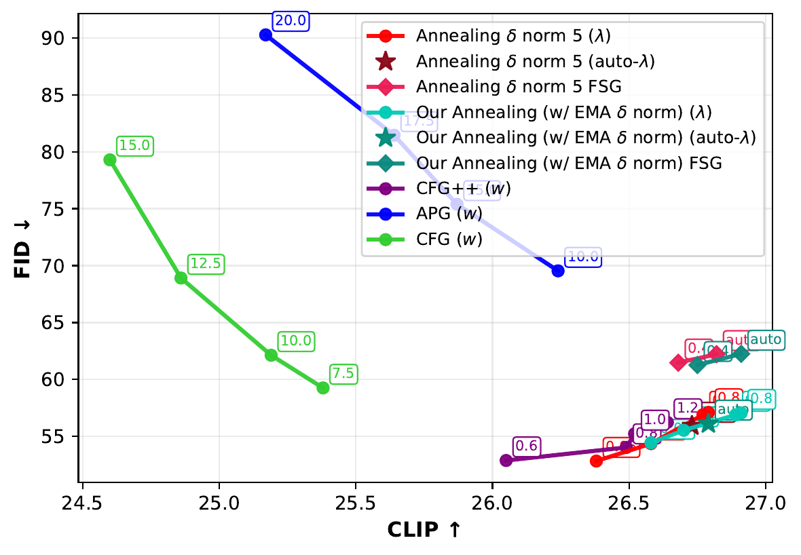

## Porting "Navigating with Annealing Guidance Scale in Diffusion Space (SIGGRAPH Asia 2025)" to Flow Matching

> **Shai Yehezkel\*, Omer Dahary\*, Andrey Voynov, Daniel Cohen-Or**
>
> Denoising diffusion models excel at generating high-quality images conditioned on text prompts, yet their effectiveness heavily relies on careful guidance during the sampling process. Classifier-Free Guidance (CFG) provides a widely used mechanism for steering generation by setting the guidance scale, which balances image quality and prompt alignment. However, the choice of the guidance scale has a critical impact on the convergence toward a visually appealing and prompt-adherent image. In this work, we propose an annealing guidance scheduler which dynamically adjusts the guidance scale over time based on the conditional noisy signal. By learning a scheduling policy, our method addresses the temperamental behavior of CFG. Empirical results demonstrate that our guidance scheduler significantly enhances image quality and alignment with the text prompt, advancing the performance of text-to-image generation. Notably, our novel scheduler requires no additional activations or memory consumption, and can seamlessly replace the common classifier-free guidance, offering an improved trade-off between prompt alignment and quality.

## Results in Flow Matching: FID vs. CLIP (SD3-medium, 20 steps, 1000 COCO val2017 prompts)

Annealing guidance (ours) dominates the FID/CLIP Pareto frontier against CFG,
APG, and CFG++, across two δ-norm training schedules (fixed `d_max=5` and
EMA-p95) and with FSG (Fixed-point Stochastic Guidance) at inference.

<p align="center">
<a href="assets/fid_vs_clip.pdf"></a>
</p>

<sub>Vector-graphics [PDF](assets/fid_vs_clip.pdf). Regenerate with
`python scripts/plot_fid_vs_clip.py` (reads the two `metrics_table.csv`
files under `results/final/a5000/`).</sub>

### Full metrics table

**bold** = best within its block (rows grouped by matched guidance strength
for the baselines, and by training/inference mode for ours).
***bold italic*** = best overall on that column. Arrows: FID lower is better;
CLIP, IR, P, R higher is better. CLIP is ViT-B/32 cosine similarity ×100.

| Method | FID ↓ | CLIP ↑ | IR ↑ | P ↑ | R ↑ |
|---|---:|---:|---:|---:|---:|
| CFG (w=7.5)             | 59.25            | 25.38            | 0.445            | 0.687            | 0.591 |
| APG (w=10)              | 69.53            | 26.24            | **0.739**        | 0.747            | 0.577 |
| CFG++ (w=0.6)           | 52.87            | 26.05            | 0.603            | 0.783            | ***0.644*** |
| Ours (λ=0.05)           | ***52.82***      | **26.38**        | 0.725            | **0.819**        | 0.629 |
| CFG (w=10)              | 62.12            | 25.19            | 0.276            | 0.620            | 0.599 |
| APG (w=15)              | 75.39            | 25.87            | 0.353            | 0.585            | 0.586 |
| CFG++ (w=0.8)           | **54.02**        | 26.49            | 0.790            | 0.829            | **0.634** |
| Ours (λ=0.4)            | 54.36            | **26.58**        | **0.822**        | **0.842**        | 0.605 |
| CFG (w=12.5)            | 68.90            | 24.87            | −0.011           | 0.510            | 0.620 |
| APG (w=17.5)            | 81.44            | 25.64            | 0.041            | 0.485            | 0.604 |
| CFG++ (w=1)             | **55.23**        | 26.52            | 0.869            | 0.829            | **0.620** |
| Ours (λ=0.7)            | 56.89            | **26.77**        | **0.970**        | ***0.845***      | 0.580 |
| CFG (w=15)              | 79.28            | 24.60            | −0.279           | 0.442            | **0.626** |
| APG (w=20)              | 90.25            | 25.17            | −0.231           | 0.385            | 0.586 |
| CFG++ (w=1.2)           | **56.22**        | 26.64            | 0.903            | 0.840            | 0.567 |
| Ours (λ=0.8)            | 57.10            | **26.79**        | **0.974**        | **0.841**        | 0.575 |
| Ours (auto-λ)           | 56.08            | 26.73            | 0.897            | 0.833            | 0.584 |
| Ours FSG (λ=0.4)        | **61.48**        | 26.68            | 0.841            | **0.797**        | 0.515 |
| Ours FSG (auto-λ)       | 62.22            | **26.82**        | **0.922**        | 0.793            | **0.533** |
| Ours-EMA (λ=0.05)       | **54.44**        | 26.58            | 0.839            | 0.832            | **0.603** |
| Ours-EMA (λ=0.4)        | 55.54            | 26.70            | 0.870            | 0.837            | 0.578 |
| Ours-EMA (λ=0.7)        | 56.90            | 26.89            | 0.981            | 0.830            | 0.576 |
| Ours-EMA (λ=0.8)        | 57.06            | ***26.91***      | ***0.993***      | **0.839**        | 0.567 |
| Ours-EMA (auto-λ)       | 56.12            | 26.79            | 0.940            | 0.832            | 0.579 |
| Ours-EMA FSG (λ=0.4)    | **61.27**        | 26.75            | 0.883            | 0.792            | 0.509 |
| Ours-EMA FSG (auto-λ)   | 62.25            | ***26.91***      | **0.959**        | **0.796**        | **0.527** |

## Background on Annealing Guidance:
<a href="https://annealing-guidance.github.io/annealing-guidance/"></a> 
<a href="https://arxiv.org/abs/2506.24108"></a>

<p align="center">

</p>


We train a guidance scale model that predicts the optimal guidance scale at each denoising step. This model leverages the null prediction for renoising, as illustrated below:

<p align="center">

</p>


## Environment Setup

Create and activate the conda environment using the provided `environment.yml`:

```sh
conda env create -f environment.yml
conda activate annealing-guidance
```

---

## Inference

To sample images with the trained annealing scheduler, edit and execute the script:

```sh
python scripts/sample.py
```

## Training

### Preparing the Data

Our training pipeline uses LAION data. To prepare the dataset, run:

```sh
python src/data/laion/download_parquet.py

cd src/data/laion  
bash to_dataset.sh
```


### Running Training

Start training with:

```sh
python scripts/train.py
```
The full training configuration is defined in: `scripts/config.yaml`.


---

## Acknowledgements 
- This code builds on the code from the [diffusers](https://github.com/huggingface/diffusers) library.
- **CFG++** for the renoising (null-prediction) step: https://github.com/CFGpp-diffusion/CFGpp  
- **CADS** for adding noise to the conditioning signal: https://arxiv.org/abs/2310.17347
## Citation
If you use this code for your research, please cite the following work: 
```
@misc{yehezkel2025annealing,
      title={Navigating with Annealing Guidance Scale in Diffusion Space}, 
      author={Shai Yehezkel and Omer Dahary and Andrey Voynov and Daniel Cohen-Or},
      year={2025},
      eprint={2506.24108},
      archivePrefix={arXiv},
      primaryClass={cs.GR},
      url={https://arxiv.org/abs/2506.24108}, 
}
```


./venv/bin/python scripts/plot_sanity_w_compare.py